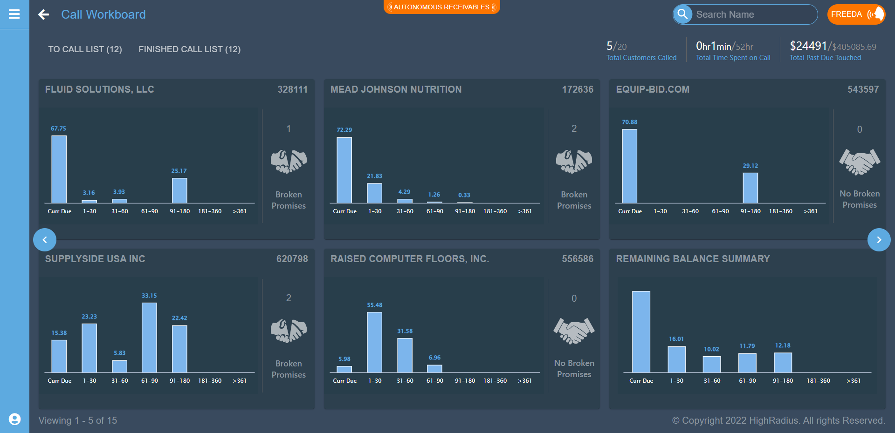

# Data Management App

The Data Management App is a comprehensive solution for efficient handling and management of data. It provides a polished and responsive user interface on the frontend, coupled with a robust and scalable backend infrastructure.

## Features

- **Frontend**: Developed using React.js and Redux for state management, offering a seamless and interactive user experience.
- **Backend**: Powered by Java SpringBoot and MySQL, ensuring reliability, security, and scalability for data management operations.
- **CRUD Functionality**: Supports Create, Read, Update, and Delete operations for efficient data handling.
  
## Technologies Used

- **Frontend**:
  - React.js
  - Redux Saga
  
- **Backend**:
  - Java SpringBoot
  - MySQL

## Installation

1. Clone the repository.
2. Navigate to the project directory.
3. Install dependencies using `npm install` or `yarn install`.
4. Configure backend settings such as MySQL connection details.
5. Run the application.

## Usage

1. Open the application in a web browser.
2. Perform CRUD operations as needed.
3. Enjoy a seamless data management experience.

## Contributing

Contributions are welcome! Please follow the guidelines in [CONTRIBUTING.md](CONTRIBUTING.md) for details on how to contribute to this project.

## License

This project is licensed under the [MIT License](LICENSE).
